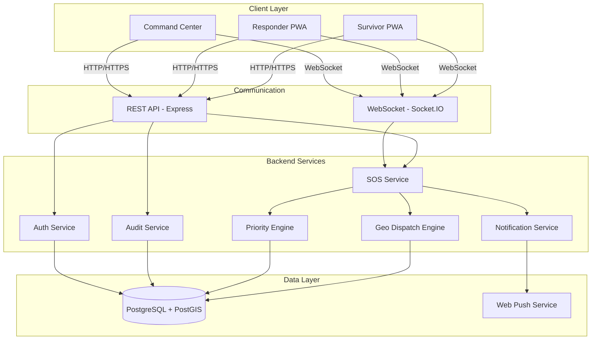
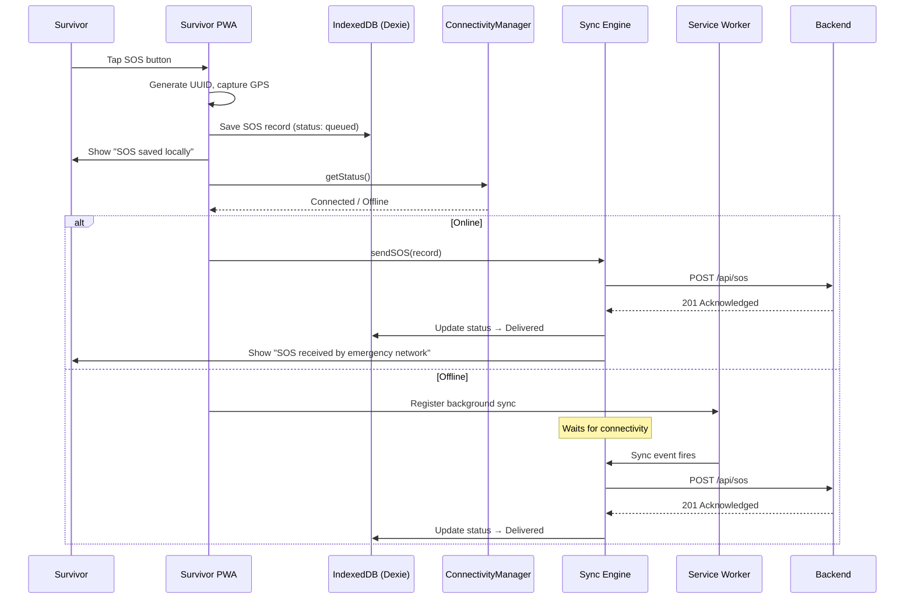
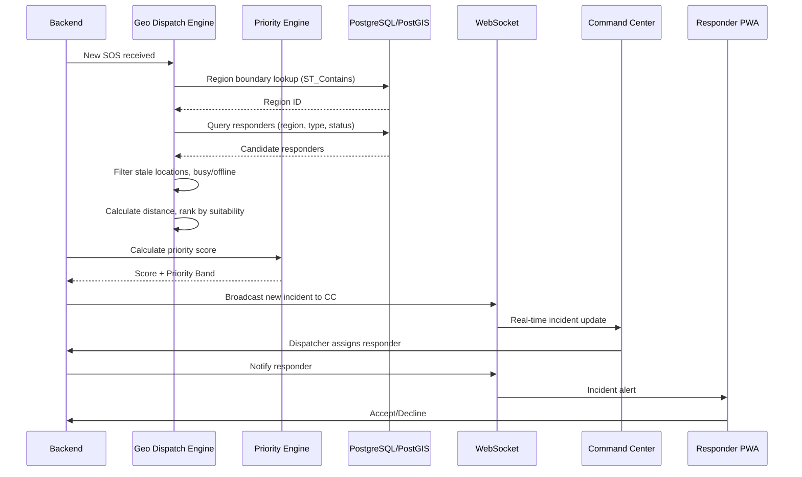
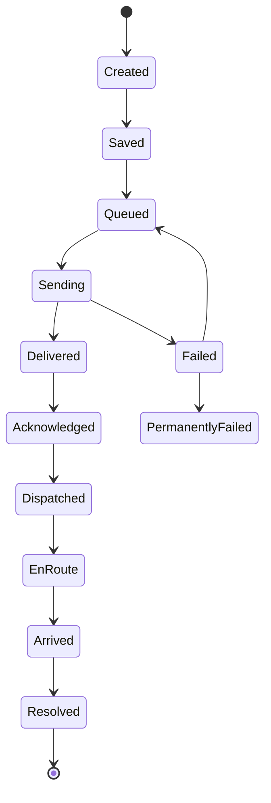

# Design Document: Emergency SOS Platform (MeshSOS)

## Overview

This design describes the architecture and technical approach for an offline-first Progressive Web Application (PWA) emergency response platform. The platform connects survivors with appropriate responders through intelligent geo-aware dispatch, consisting of three applications — Survivor PWA, Responder PWA, and Command Center — communicating with a shared Node.js/Express backend backed by PostgreSQL.

The system prioritizes:
1. **SOS preservation** — an emergency request is never lost once created
2. **Delivery transparency** — the system never lies about whether an SOS has reached the backend
3. **Geo-aware dispatch** — once the backend receives an SOS, it identifies the appropriate region and best-suited responder
4. **Offline resilience** — the survivor can create and store an SOS regardless of connectivity

### Key Design Decisions

| Decision | Choice | Rationale |
|----------|--------|-----------|
| Offline storage | IndexedDB via Dexie | Structured data, good PWA support, transactional |
| Real-time transport | Socket.IO | Fallback support, room-based broadcasting, reconnection built-in |
| Map library | Leaflet | Lightweight, open-source, good clustering plugins |
| State management | React Context + reducers per feature | Simpler than Redux for isolated feature domains |
| API protocol | REST + WebSocket events | REST for CRUD, WebSocket for live updates |
| Authentication | JWT access tokens + secure HTTP-only refresh cookies | Stateless verification, secure rotation |
| Geospatial | PostGIS extension on PostgreSQL | Native boundary containment queries, distance calculations |
| PWA tooling | Vite PWA plugin + Workbox | Precaching, runtime caching strategies, background sync |
| i18n | react-i18next | Established, supports lazy-loading translation bundles |

---

## Architecture

### High-Level System Diagram



### Offline-First Data Flow (Survivor)



### Dispatch Flow



---

## Components and Interfaces

### 1. Survivor PWA Components

#### ConnectivityManager (Interface)

```typescript
interface ConnectivityState {
  status: 'connected' | 'weak' | 'offline';
  lastChecked: Date;
}

interface SendResult {
  success: boolean;
  error?: string;
}

interface ConnectivityManager {
  getStatus(): ConnectivityState;
  sendSOS(sos: SOSRecord): Promise<SendResult>;
  retryPendingSOS(): Promise<SendResult[]>;
  getDeliveryStatus(sosId: string): Promise<DeliveryStatus>;
  subscribe(listener: (state: ConnectivityState) => void): () => void;
}
```

#### WebConnectivityProvider (Implementation)

```typescript
class WebConnectivityProvider implements ConnectivityManager {
  private status: ConnectivityState;
  private listeners: Set<(state: ConnectivityState) => void>;
  private healthCheckInterval: number;
  private backendUrl: string;

  constructor(config: { backendUrl: string; healthCheckIntervalMs: number });

  getStatus(): ConnectivityState;
  sendSOS(sos: SOSRecord): Promise<SendResult>;
  retryPendingSOS(): Promise<SendResult[]>;
  getDeliveryStatus(sosId: string): Promise<DeliveryStatus>;
  subscribe(listener: (state: ConnectivityState) => void): () => void;

  // Internal
  private performHealthCheck(): Promise<void>;
  private measureLatency(): Promise<number>;
}
```

#### SyncEngine

```typescript
class SyncEngine {
  private db: DexieDatabase;
  private connectivity: ConnectivityManager;
  private isSyncing: boolean;
  private retryTimers: Map<string, NodeJS.Timeout>;

  constructor(db: DexieDatabase, connectivity: ConnectivityManager);

  enqueueSOS(sos: SOSRecord): Promise<void>;
  processQueue(): Promise<void>;
  getQueuedCount(): number;
  onConnectivityChange(state: ConnectivityState): void;

  // Exponential backoff: min(5 * 2^retryCount, 300) seconds
  private calculateBackoff(retryCount: number): number;
  private deliverSOS(sos: SOSRecord): Promise<boolean>;
}
```

#### SOSCreator

```typescript
interface SOSCreator {
  createSOS(emergencyType: EmergencyType): Promise<SOSRecord>;
  addDetails(sosId: string, details: SOSDetails): Promise<void>;
  isDuplicateAttempt(emergencyType: EmergencyType): boolean;
}
```

#### LocationService

```typescript
interface LocationResult {
  latitude: number;
  longitude: number;
  accuracy: number;
  timestamp: Date;
  method: 'live' | 'lastKnown';
}

interface LocationService {
  getCurrentPosition(timeoutMs: number): Promise<LocationResult | null>;
  getLastKnownPosition(maxAgeMs: number): LocationResult | null;
  hasPermission(): Promise<boolean>;
}
```

### 2. Responder PWA Components

#### ResponderStatusManager

```typescript
type ResponderStatus = 'available' | 'busy' | 'assigned' | 'enRoute' | 'onScene' | 'offline';

interface ResponderStatusManager {
  getCurrentStatus(): ResponderStatus;
  setStatus(status: ResponderStatus): Promise<void>;
  getLocationUpdater(): LocationUpdater;
}
```

#### IncidentAlertHandler

```typescript
interface IncidentAlert {
  incidentId: string;
  priorityLevel: PriorityBand;
  emergencyType: EmergencyType;
  distanceKm: number;
  peopleCount: number | null;
  location: { latitude: number; longitude: number };
  expiresAt: Date; // 120 seconds from receipt
}

interface IncidentAlertHandler {
  onAlertReceived(alert: IncidentAlert): void;
  acceptIncident(incidentId: string): Promise<void>;
  declineIncident(incidentId: string): Promise<void>;
  onAlertExpired(incidentId: string): void;
}
```

### 3. Command Center Components

#### LiveMapController

```typescript
interface LiveMapController {
  initializeMap(container: HTMLElement): void;
  updateIncidents(incidents: MapIncident[]): void;
  updateResponders(responders: MapResponder[]): void;
  updateStations(stations: MapStation[]): void;
  applyFilters(filters: IncidentFilters): void;
  setClusteringEnabled(enabled: boolean): void;
}
```

#### DispatchPanelController

```typescript
interface RankedResponder {
  responderId: string;
  name: string;
  distanceKm: number;
  status: ResponderStatus;
  locationFreshness: number; // seconds since last update
  suitabilityScore: number;
  isFresh: boolean; // within staleness threshold
}

interface DispatchPanelController {
  getRankedResponders(incidentId: string): Promise<RankedResponder[]>;
  dispatchResponder(incidentId: string, responderId: string): Promise<void>;
  overrideDispatch(incidentId: string, responderId: string, reason: string): Promise<void>;
}
```

### 4. Backend Services

#### SOS Service (Express Router)

```
POST   /api/sos              - Create new SOS
GET    /api/sos/:id          - Get SOS details
PATCH  /api/sos/:id          - Update SOS (additional info)
GET    /api/sos/:id/timeline - Get SOS event timeline
GET    /api/sos/history      - Get survivor's SOS history
POST   /api/sos/:id/ack      - Acknowledge SOS (dispatcher)
```

#### Geo Dispatch Engine

```typescript
interface GeoDispatchEngine {
  detectRegion(lat: number, lng: number): Promise<Region | null>;
  getResponderPool(regionId: string, emergencyType: EmergencyType): Promise<Responder[]>;
  rankResponders(candidates: Responder[], incident: SOSIncident): RankedResponder[];
  escalate(incidentId: string, currentLevel: EscalationLevel): Promise<void>;
}
```

**Ranking Algorithm:**
1. Filter out Busy/Offline responders
2. Filter out responders with location freshness > staleness threshold (default 5 min)
3. Calculate Haversine distance from incident to each responder
4. Score = weighted sum of: inverse distance (40%), type match (25%), freshness (20%), jurisdiction match (15%)
5. Sort descending by score; break ties by most recent location update
6. Return top 10

#### Priority Engine

```typescript
interface PriorityEngine {
  calculateScore(sos: SOSIncident): PriorityResult;
  recalculate(sosId: string): Promise<PriorityResult>;
}

interface PriorityResult {
  score: number;       // 0-100
  band: PriorityBand;  // Critical | High | Medium | Low
  factors: PriorityFactor[];
}
```

**Scoring factors:**
| Factor | Points | Condition |
|--------|--------|-----------|
| Medical emergency | +40 | type === 'medical' |
| Vulnerable (Children/Elderly) | +25 | type === 'childrenElderly' |
| 5+ people | +20 | peopleCount >= 5 |
| Waiting > 15 min | +15 | now - createdAt > 15min |
| High-risk zone | +20 | region has active disaster event |

Score capped at 100. Band assignment: 81–100 Critical, 61–80 High, 31–60 Medium, 0–30 Low.

#### Audit Service

```typescript
interface AuditEvent {
  id: string;
  sosId?: string;
  eventType: AuditEventType;
  actorId: string;
  timestamp: Date;       // UTC, millisecond precision
  previousState?: string;
  newState?: string;
  metadata: Record<string, unknown>;
}

interface AuditService {
  record(event: Omit<AuditEvent, 'id' | 'timestamp'>): Promise<void>;
  query(filters: AuditQuery): Promise<PaginatedResult<AuditEvent>>;
}
```

#### WebSocket Event Broadcasting

```typescript
// Server-side Socket.IO rooms:
// - `command-center` — all CC clients
// - `responder:{id}` — individual responder
// - `survivor:{sessionId}` — individual survivor
// - `region:{regionId}` — region-scoped events

interface WebSocketEvents {
  // Server → Client
  'sos:created': (incident: SOSBroadcast) => void;
  'sos:updated': (update: SOSUpdate) => void;
  'sos:stateChange': (change: StateChange) => void;
  'responder:locationUpdate': (update: LocationUpdate) => void;
  'responder:statusChange': (change: StatusChange) => void;
  'dispatch:assigned': (assignment: DispatchAssignment) => void;
  'system:health': (status: SystemHealth) => void;

  // Client → Server
  'responder:accept': (incidentId: string) => void;
  'responder:decline': (incidentId: string) => void;
  'responder:location': (location: LocationPayload) => void;
}
```

---

## Data Models

### Local Database (IndexedDB via Dexie)

```typescript
// Survivor PWA local schema
interface LocalSOSRecord {
  id: string;                    // UUID
  emergencyType: EmergencyType;  // 'police' | 'medical' | 'food' | 'childrenElderly'
  latitude: number | null;
  longitude: number | null;
  accuracy: number | null;
  locationMethod: 'live' | 'lastKnown' | null;
  locationTimestamp: Date | null;
  timestamp: Date;
  peopleCount: number | null;
  situationType: string | null;
  description: string | null;
  priority: PriorityBand | null;
  status: SOSStatus;
  retryCount: number;
  lastTransmissionAttempt: Date | null;
  createdAt: Date;
  updatedAt: Date;
}

interface LocalProfile {
  name: string | null;
  language: 'en' | 'hi';
  emergencyContact: string | null;
  householdSize: number | null;
  accessibility: AccessibilityPreferences;
}

interface LocalPushSubscription {
  endpoint: string;
  keys: { p256dh: string; auth: string };
  registeredAt: Date;
}

type SOSStatus = 'created' | 'saved' | 'queued' | 'sending' | 'delivered'
  | 'acknowledged' | 'dispatched' | 'enRoute' | 'arrived' | 'resolved'
  | 'failed' | 'permanentlyFailed';

type EmergencyType = 'police' | 'medical' | 'food' | 'childrenElderly';
type PriorityBand = 'critical' | 'high' | 'medium' | 'low';
```

### PostgreSQL Schema (Backend)

```sql
-- Enable PostGIS
CREATE EXTENSION IF NOT EXISTS postgis;

-- Users
CREATE TABLE users (
  id UUID PRIMARY KEY DEFAULT gen_random_uuid(),
  role VARCHAR(20) NOT NULL CHECK (role IN ('survivor', 'responder', 'dispatcher', 'supervisor', 'administrator', 'auditor')),
  name VARCHAR(100),
  email VARCHAR(255) UNIQUE,
  password_hash VARCHAR(255),
  language VARCHAR(5) DEFAULT 'en',
  emergency_contact VARCHAR(20),
  mfa_enabled BOOLEAN DEFAULT false,
  created_at TIMESTAMPTZ DEFAULT NOW(),
  updated_at TIMESTAMPTZ DEFAULT NOW()
);

-- Regions with geographic boundaries
CREATE TABLE regions (
  id UUID PRIMARY KEY DEFAULT gen_random_uuid(),
  name VARCHAR(255) NOT NULL,
  boundary GEOMETRY(Polygon, 4326) NOT NULL,
  status VARCHAR(20) DEFAULT 'active',
  created_at TIMESTAMPTZ DEFAULT NOW()
);
CREATE INDEX idx_regions_boundary ON regions USING GIST(boundary);

-- Stations
CREATE TABLE stations (
  id UUID PRIMARY KEY DEFAULT gen_random_uuid(),
  name VARCHAR(255) NOT NULL,
  type VARCHAR(50) NOT NULL CHECK (type IN ('police', 'hospital', 'relief')),
  location GEOMETRY(Point, 4326) NOT NULL,
  region_id UUID REFERENCES regions(id),
  contact VARCHAR(100),
  capacity INTEGER,
  services JSONB,
  officer_count INTEGER,
  status VARCHAR(20) DEFAULT 'active',
  created_at TIMESTAMPTZ DEFAULT NOW(),
  updated_at TIMESTAMPTZ DEFAULT NOW()
);

-- Responders
CREATE TABLE responders (
  id UUID PRIMARY KEY DEFAULT gen_random_uuid(),
  user_id UUID REFERENCES users(id) NOT NULL,
  organization VARCHAR(255),
  station_id UUID REFERENCES stations(id),
  type VARCHAR(50) NOT NULL CHECK (type IN ('police', 'medical', 'rescue', 'relief', 'social')),
  current_location GEOMETRY(Point, 4326),
  location_updated_at TIMESTAMPTZ,
  status VARCHAR(20) DEFAULT 'offline' CHECK (status IN ('available', 'busy', 'assigned', 'enRoute', 'onScene', 'offline')),
  current_incident_id UUID,
  vehicle VARCHAR(100),
  capabilities JSONB,
  created_at TIMESTAMPTZ DEFAULT NOW(),
  updated_at TIMESTAMPTZ DEFAULT NOW()
);
CREATE INDEX idx_responders_location ON responders USING GIST(current_location);
CREATE INDEX idx_responders_status ON responders(status);

-- SOS Incidents
CREATE TABLE sos_incidents (
  id UUID PRIMARY KEY,
  user_session_id VARCHAR(255),
  user_id UUID REFERENCES users(id),
  emergency_type VARCHAR(20) NOT NULL CHECK (emergency_type IN ('police', 'medical', 'food', 'childrenElderly')),
  location GEOMETRY(Point, 4326),
  accuracy REAL,
  location_method VARCHAR(10),
  location_timestamp TIMESTAMPTZ,
  people_count INTEGER,
  situation_type VARCHAR(50),
  description VARCHAR(200),
  priority_score INTEGER DEFAULT 0,
  priority_band VARCHAR(10) DEFAULT 'low',
  status VARCHAR(20) DEFAULT 'delivered',
  region_id UUID REFERENCES regions(id),
  assigned_responder_id UUID REFERENCES responders(id),
  disaster_event_id UUID,
  duplicate_flag BOOLEAN DEFAULT false,
  duplicate_of UUID REFERENCES sos_incidents(id),
  created_at TIMESTAMPTZ NOT NULL,
  updated_at TIMESTAMPTZ DEFAULT NOW()
);
CREATE INDEX idx_sos_location ON sos_incidents USING GIST(location);
CREATE INDEX idx_sos_status ON sos_incidents(status);
CREATE INDEX idx_sos_region ON sos_incidents(region_id);
CREATE INDEX idx_sos_priority ON sos_incidents(priority_band);

-- SOS Lifecycle Events
CREATE TABLE sos_events (
  id UUID PRIMARY KEY DEFAULT gen_random_uuid(),
  sos_id UUID REFERENCES sos_incidents(id) NOT NULL,
  event_type VARCHAR(50) NOT NULL,
  actor_id UUID,
  previous_state VARCHAR(20),
  new_state VARCHAR(20),
  metadata JSONB,
  timestamp TIMESTAMPTZ DEFAULT NOW()
);
CREATE INDEX idx_sos_events_sos_id ON sos_events(sos_id);
CREATE INDEX idx_sos_events_timestamp ON sos_events(timestamp);

-- Audit Trail (append-only)
CREATE TABLE audit_trail (
  id UUID PRIMARY KEY DEFAULT gen_random_uuid(),
  sos_id UUID,
  event_type VARCHAR(100) NOT NULL,
  actor_id UUID,
  target_entity_id UUID,
  previous_value JSONB,
  new_value JSONB,
  metadata JSONB,
  timestamp TIMESTAMPTZ DEFAULT NOW()
);
CREATE INDEX idx_audit_sos ON audit_trail(sos_id);
CREATE INDEX idx_audit_actor ON audit_trail(actor_id);
CREATE INDEX idx_audit_type ON audit_trail(event_type);
CREATE INDEX idx_audit_timestamp ON audit_trail(timestamp);

-- Disaster Events
CREATE TABLE disaster_events (
  id UUID PRIMARY KEY DEFAULT gen_random_uuid(),
  name VARCHAR(255) NOT NULL,
  region_id UUID REFERENCES regions(id),
  severity VARCHAR(20),
  status VARCHAR(20) DEFAULT 'active',
  start_at TIMESTAMPTZ NOT NULL,
  end_at TIMESTAMPTZ,
  created_at TIMESTAMPTZ DEFAULT NOW()
);

-- Push Subscriptions
CREATE TABLE push_subscriptions (
  id UUID PRIMARY KEY DEFAULT gen_random_uuid(),
  user_session_id VARCHAR(255),
  user_id UUID REFERENCES users(id),
  endpoint TEXT NOT NULL,
  keys JSONB NOT NULL,
  active BOOLEAN DEFAULT true,
  created_at TIMESTAMPTZ DEFAULT NOW()
);

-- Sessions
CREATE TABLE sessions (
  id UUID PRIMARY KEY DEFAULT gen_random_uuid(),
  user_id UUID REFERENCES users(id) NOT NULL,
  token_hash VARCHAR(255) NOT NULL,
  device_info JSONB,
  expires_at TIMESTAMPTZ NOT NULL,
  last_active_at TIMESTAMPTZ DEFAULT NOW(),
  created_at TIMESTAMPTZ DEFAULT NOW()
);
```

### State Machine: SOS Lifecycle



Valid transitions (enforced by backend):
```typescript
const VALID_TRANSITIONS: Record<SOSStatus, SOSStatus[]> = {
  created: ['saved'],
  saved: ['queued'],
  queued: ['sending'],
  sending: ['delivered', 'failed'],
  failed: ['queued', 'permanentlyFailed'],
  delivered: ['acknowledged'],
  acknowledged: ['dispatched'],
  dispatched: ['enRoute'],
  enRoute: ['arrived'],
  arrived: ['resolved'],
  resolved: [],
  permanentlyFailed: [],
};
```

---

## Correctness Properties

*A property is a characteristic or behavior that should hold true across all valid executions of a system — essentially, a formal statement about what the system should do. Properties serve as the bridge between human-readable specifications and machine-verifiable correctness guarantees.*

### Property 1: SOS Creation Completeness

*For any* valid emergency type tap event, the resulting SOS record SHALL contain a valid UUID identifier, the selected emergency type, a timestamp, and (when GPS is available) latitude, longitude, accuracy, acquisition method, and location timestamp — all matching the input.

**Validates: Requirements 1.2, 2.3, 3.1**

### Property 2: Local-First Persistence Invariant

*For any* SOS creation event regardless of connectivity state, the SOS record SHALL be persisted to IndexedDB before any network communication is attempted, and SHALL remain in local storage until the Backend returns a specific acknowledgement for that record.

**Validates: Requirements 1.4, 3.3, 3.6**

### Property 3: Location Age Threshold

*For any* last-known location with an age value, the system SHALL use it as the SOS location if and only if the age is less than or equal to 30 minutes. Locations older than 30 minutes SHALL be treated as unavailable.

**Validates: Requirements 2.2, 2.5**

### Property 4: Delivery Transparency

*For any* SOS record, the displayed delivery status SHALL equal the record's actual status, and *for any* SOS that has not received Backend confirmation (status in queued, sending, or failed), the system SHALL NOT display any message indicating the SOS has been received by the emergency network.

**Validates: Requirements 6.1, 6.2, 6.6**

### Property 5: Queue Delivery Order

*For any* set of queued SOS records with distinct creation timestamps, the Sync Engine SHALL attempt delivery in strictly ascending creation-time order.

**Validates: Requirements 5.1**

### Property 6: Exponential Backoff (Sync)

*For any* SOS delivery retry with retry count `n` (where 0 ≤ n < 10), the backoff interval SHALL equal `min(5 × 2^n, 300)` seconds.

**Validates: Requirements 5.4**

### Property 7: Retry Exhaustion

*For any* SOS record that has failed delivery for 10 consecutive attempts, the system SHALL mark it as Failed and cease automatic retry until the next connectivity-change or app-focus event.

**Validates: Requirements 5.6**

### Property 8: Delivery Confirmation Transition

*For any* SOS that receives Backend acknowledgement, the system SHALL update its local status to "delivered" and remove it from the pending delivery queue.

**Validates: Requirements 5.5**

### Property 9: SOS List Ordering

*For any* collection of locally stored SOS records, the displayed list SHALL be ordered by creation time with the most recent record first (descending).

**Validates: Requirements 7.1**

### Property 10: State Machine Enforcement

*For any* SOS state and attempted transition target, the Backend SHALL accept the transition if and only if the (current_state, target_state) pair exists in the valid transitions table. All other transitions SHALL be rejected.

**Validates: Requirements 10.1**

### Property 11: Audit Trail Completeness

*For any* SOS state transition, dispatch decision, responder assignment, override, escalation, authentication event, role change, or administrative configuration change, the system SHALL create an append-only audit event containing: entity ID, event type, actor ID, UTC timestamp with millisecond precision, previous state, new state, and action-specific metadata.

**Validates: Requirements 10.4, 19.3, 21.3, 40.1, 40.2, 40.3**

### Property 12: Audit Immutability

*For any* audit record once persisted, the system SHALL NOT allow modification or deletion through any API endpoint or user-facing operation. If audit persistence fails, the originating operation SHALL be rejected.

**Validates: Requirements 40.4, 40.5**

### Property 13: SOS Lifecycle Timeline Ordering

*For any* set of state transition events for an SOS, the displayed timeline SHALL be ordered chronologically from oldest to newest.

**Validates: Requirements 10.5**

### Property 14: Additional Information Independence

*For any* SOS creation attempt, the system SHALL complete SOS creation and queuing without requiring any additional information fields (people count, situation type, description) or profile data or authentication to be provided.

**Validates: Requirements 12.2, 13.2, 37.5**

### Property 15: Profile Inclusion with SOS

*For any* survivor who has populated one or more profile fields, every SOS created by that survivor SHALL include all populated profile fields in the payload sent to the Backend.

**Validates: Requirements 13.3**

### Property 16: Profile Input Validation

*For any* profile field value that exceeds its maximum length (name > 100, contact > 20, description > 200) or falls outside its valid range (household size outside 1–99), the system SHALL reject the input and display an error message.

**Validates: Requirements 13.6**

### Property 17: ConnectivityManager Status Domain

*For any* invocation of getStatus(), the return value SHALL be exactly one of: "connected", "weak", or "offline".

**Validates: Requirements 4.1, 44.2**

### Property 18: Non-Destructive Provider Failure

*For any* call to sendSOS() or retryPendingSOS() that fails due to a provider error, the locally stored SOS record SHALL remain unmodified.

**Validates: Requirements 44.4**

### Property 19: Emergency-Type Routing

*For any* SOS with a determined region, the Geo Dispatch Engine SHALL route to the correct responder pool based on emergency type: Police/Rescue → police officers, rescue teams, disaster response; Medical → ambulances, medical responders, hospitals; Food/Water → relief teams, local administration, distribution centers; Children/Elderly → social-response teams, police, medical services.

**Validates: Requirements 30.1, 30.2, 30.3, 30.4**

### Property 20: Region Detection

*For any* GPS coordinates that fall within exactly one defined region boundary, the Geo Dispatch Engine SHALL return that region. *For any* coordinates that fall outside all boundaries, the system SHALL assign "unresolved region" status.

**Validates: Requirements 29.1, 29.3**

### Property 21: Responder Ranking Constraints

*For any* set of candidate responders, the ranking SHALL: (a) exclude all responders with status Busy or Offline, (b) rank any responder whose location freshness exceeds the staleness threshold below all responders within the threshold, (c) break ties by most recent location update, and (d) return at most 10 results.

**Validates: Requirements 31.1, 31.2, 31.3, 31.6**

### Property 22: Location Freshness Calculation

*For any* responder with a recorded location_updated_at timestamp, Location_Freshness SHALL equal the elapsed time since that timestamp, and *for any* responder whose freshness exceeds the configured staleness threshold, the system SHALL flag that location as potentially unreliable.

**Validates: Requirements 32.1, 32.2**

### Property 23: Escalation Chain Progression

*For any* dispatch where the assigned responder does not acknowledge within the configured timeout, the system SHALL escalate to the next ranked responder; if all individual responders fail, escalate to station dispatcher; if station dispatcher doesn't respond, escalate to supervisor.

**Validates: Requirements 33.1, 33.2, 33.3**

### Property 24: Priority Score Calculation

*For any* SOS, the Priority Engine SHALL calculate the score as the sum of applicable factors (Medical +40, Vulnerable +25, 5+ people +20, wait >15min +15, high-risk zone +20) capped at 100, assign band (81–100 Critical, 61–80 High, 31–60 Medium, 0–30 Low), and use only available factors when data is missing.

**Validates: Requirements 35.1, 35.2, 35.3**

### Property 25: RBAC Enforcement

*For any* authenticated user with a given role attempting any action on any resource, the Backend SHALL permit the action if and only if the role's defined permission scope includes that action. Denied requests SHALL be logged with user ID, action, resource, and timestamp.

**Validates: Requirements 36.1, 36.3, 36.4**

### Property 26: Deduplication Detection

*For any* two SOS records from the same device/session with proximate location, proximate timestamp, and same emergency category, the Backend SHALL flag the later submission as a "possible duplicate" for dispatcher review without automatically discarding it.

**Validates: Requirements 34.1, 34.2**

### Property 27: SOS Cluster Aggregation

*For any* set of SOS incidents whose geographic coordinates fall within a defined proximity threshold on the map, the Command Center SHALL cluster them into a single marker displaying the count, with the ability to zoom into individual incidents.

**Validates: Requirements 23.4**

### Property 28: Incident Filter Correctness

*For any* combination of active filters (type, priority, region, time range, status) applied to any set of incidents, all displayed incidents SHALL match every active filter criterion and no incident matching all criteria SHALL be excluded.

**Validates: Requirements 24.2**

### Property 29: Responder Status Validity

*For any* responder status update, the new status value SHALL be one of: Available, Busy, Assigned, En Route, On Scene, or Offline.

**Validates: Requirements 19.1**

### Property 30: Responder Workflow State Machine

*For any* responder workflow state and attempted transition, the system SHALL accept the transition if and only if it follows the defined path: Available → Incident Received → Accept → En Route → Arrived → Assisted → Resolved.

**Validates: Requirements 21.1**

### Property 31: Suspicious Behavior Detection

*For any* SOS submission pattern matching defined suspicious criteria (rapid repeated submissions, impossible location changes), the Backend SHALL flag the submission for dispatcher review without automatically blocking it.

**Validates: Requirements 39.2, 39.3**

### Property 32: Audit Query Pagination

*For any* audit trail query, the Backend SHALL return results filtered by the specified criteria, ordered by timestamp, in pages of at most 100 records per response.

**Validates: Requirements 40.6**

### Property 33: Response Metric Accuracy

*For any* incident with recorded state transition timestamps, acknowledgement time SHALL equal (acknowledged_at − created_at), dispatch time SHALL equal (dispatched_at − created_at), travel time SHALL equal (arrived_at − dispatched_at), resolution time SHALL equal (resolved_at − created_at), and delivery time SHALL equal (delivered_at − created_at).

**Validates: Requirements 41.1, 41.2, 41.3, 41.4, 41.5**

### Property 34: WebSocket Reconnection Backoff

*For any* WebSocket reconnection retry attempt `n` (where 0 ≤ n < 10), the backoff interval SHALL equal `2^n` seconds (starting at 1 second, doubling each attempt).

**Validates: Requirements 43.4**

### Property 35: Facility Coordinate Validation

*For any* station or facility creation/activation, the Backend SHALL validate that geographic coordinates are present and within valid ranges (latitude: −90 to +90, longitude: −180 to +180) before permitting activation.

**Validates: Requirements 27.4**

### Property 36: MFA Requirement for Privileged Roles

*For any* authentication attempt for Dispatcher, Supervisor, or Administrator roles, the system SHALL require multi-factor authentication before granting access.

**Validates: Requirements 37.2**

### Property 37: Low-Battery Mode Core Functionality

*For any* SOS creation, local storage, or delivery attempt made while low-battery mode is active, the operation SHALL complete successfully without degradation of the core SOS workflow.

**Validates: Requirements 17.3**

### Property 38: Notification Content Completeness

*For any* push notification sent for an SOS state transition, the notification payload SHALL contain the SOS identifier and a status message indicating the new state.

**Validates: Requirements 11.4**

### Property 39: Incident Alert Content

*For any* incident alert sent to a responder, the alert SHALL contain: incident priority level, emergency type, distance from responder, people count, and location coordinates.

**Validates: Requirements 20.1**

---

## Error Handling

### Frontend Error Strategies

| Error Scenario | Handling |
|---|---|
| IndexedDB write failure | Retry once; if retry fails, show error "SOS could not be saved" and prompt user to try again. Never show false confirmation. |
| GPS acquisition timeout (>10s) | Fall back to last known location (if ≤30 min old); otherwise create SOS without coordinates and inform user. |
| GPS permission denied | Create SOS without coordinates; display clear message about missing location. |
| Network delivery failure | Increment retry count, apply exponential backoff (5s base, 5min max, 10 attempts max). Mark as Failed after exhaustion. |
| WebSocket disconnection | Auto-reconnect with exponential backoff (1s base, 10 attempts). Show degraded connection indicator. After exhaustion, show manual reconnect button. |
| Service Worker cache miss (offline) | Display "needs online first" message explaining first-time setup requirement. |
| Push notification permission denied | Continue without push; show status updates only in-app. |
| Profile validation failure | Inline error on the specific field; do not block other operations. |
| Duplicate SOS tap (<30s) | Prompt user to confirm intent before creating additional SOS. |

### Backend Error Strategies

| Error Scenario | Handling |
|---|---|
| Invalid state transition | Return 409 Conflict with explanation of valid transitions. Log attempt in audit trail. |
| Region not found for coordinates | Assign "unresolved region" status; place in Command Center queue for manual assignment. |
| Missing/invalid GPS in SOS | Assign "unresolved location" status; place in dispatch queue for manual review. |
| Audit persistence failure | Reject the originating operation entirely. Return 500 with "action could not be completed" message. |
| Rate limit exceeded | Return 429 with Retry-After header. Do not discard the SOS — allow retry after cooldown. |
| Duplicate SOS detected | Flag for dispatcher review; never auto-discard. |
| Push subscription expired | Mark subscription inactive; stop retry to that endpoint. |
| Responder escalation exhaustion | Escalate through chain (individual → station → supervisor). Log all escalation attempts. |
| Authorization failure | Return 403; log attempt with user, action, resource, timestamp. |
| Database connection failure | Return 503; queue retryable operations; expose in system health dashboard. |

### Resilience Principles

1. **Never lose a saved SOS** — once written to IndexedDB, it persists until backend acknowledges.
2. **Never lie about delivery** — UI status always reflects actual state.
3. **Never auto-discard** — suspicious or duplicate SOS records are flagged for human review, never silently dropped.
4. **Fail open for survivors** — authentication, profile, and optional data failures never block SOS creation.
5. **Fail closed for audit** — if an action cannot be audited, the action is rejected.

---

## Testing Strategy

### Property-Based Testing

**Library**: [fast-check](https://github.com/dubzzz/fast-check) (TypeScript property-based testing)

**Configuration**: Minimum 100 iterations per property test.

**Tag format**: `Feature: emergency-sos-platform, Property {N}: {property_text}`

Property-based tests validate the 39 correctness properties defined above. Key areas:

- **SOS creation logic** (Properties 1–4, 14): Generate random emergency types, GPS states, connectivity states, and verify all invariants hold.
- **Sync Engine** (Properties 5–8): Generate random queues of SOS records with varying retry counts and verify ordering, backoff, and transitions.
- **State machines** (Properties 10, 29, 30): Generate random sequences of state transitions and verify only valid transitions are accepted.
- **Geo Dispatch Engine** (Properties 19–23): Generate random region configurations, responder sets with varying attributes, and verify routing, ranking, freshness, and escalation.
- **Priority Engine** (Property 24): Generate random combinations of priority factors and verify score calculation and band assignment.
- **RBAC** (Properties 25, 36): Generate random (role, action, resource) triples and verify permission enforcement.
- **Audit Trail** (Properties 11, 12, 32): Generate random operations and verify audit records are created, immutable, and queryable.
- **Deduplication** (Property 26): Generate pairs of SOS records with varying similarity and verify detection.
- **Metrics** (Property 33): Generate random timestamp sets and verify metric calculations.

### Unit Testing (Example-Based)

Focus areas:
- Specific UI states (connectivity indicator messages, empty states, offline mode visibility)
- Push notification content formatting
- Manifest and PWA configuration validation
- Accessibility compliance (touch targets, ARIA labels, keyboard navigation)
- Specific CRUD operations (stations, hospitals, disaster events)
- Session management and MFA flows
- i18n translation key coverage

**Framework**: Vitest + React Testing Library

### Integration Testing

- Service Worker caching behavior (install, activate, offline serve)
- WebSocket connection lifecycle (connect, disconnect, reconnect, missed events)
- Full SOS lifecycle end-to-end (create → queue → deliver → acknowledge → dispatch → resolve)
- Database persistence across app restarts
- Push notification delivery pipeline
- Background Sync registration and execution
- Profile persistence across sessions

### End-to-End Testing

- Survivor creates SOS while offline → connectivity returns → SOS delivered → responder assigned
- Dispatcher views live map, filters incidents, assigns responder
- Responder receives alert, accepts, progresses through workflow
- Escalation chain triggered when responder doesn't acknowledge
- Complete dispatch flow with human override

**Framework**: Playwright

### Accessibility Testing

- axe-core automated checks on all pages
- Keyboard navigation audit
- Screen reader compatibility (VoiceOver, NVDA)
- Color contrast verification
- Reduced motion compliance

### Performance Testing

- SOS creation < 2 seconds (offline and online)
- Offline app load < 4 seconds from Service Worker cache
- Filter application < 2 seconds in Command Center
- Region detection < 2 seconds on backend
- Real-time broadcasts < 2 seconds of state change
- Map rendering with 500+ markers
