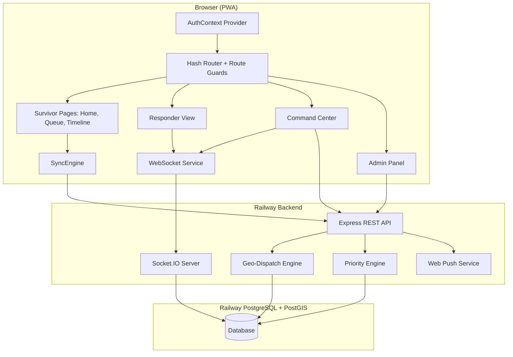
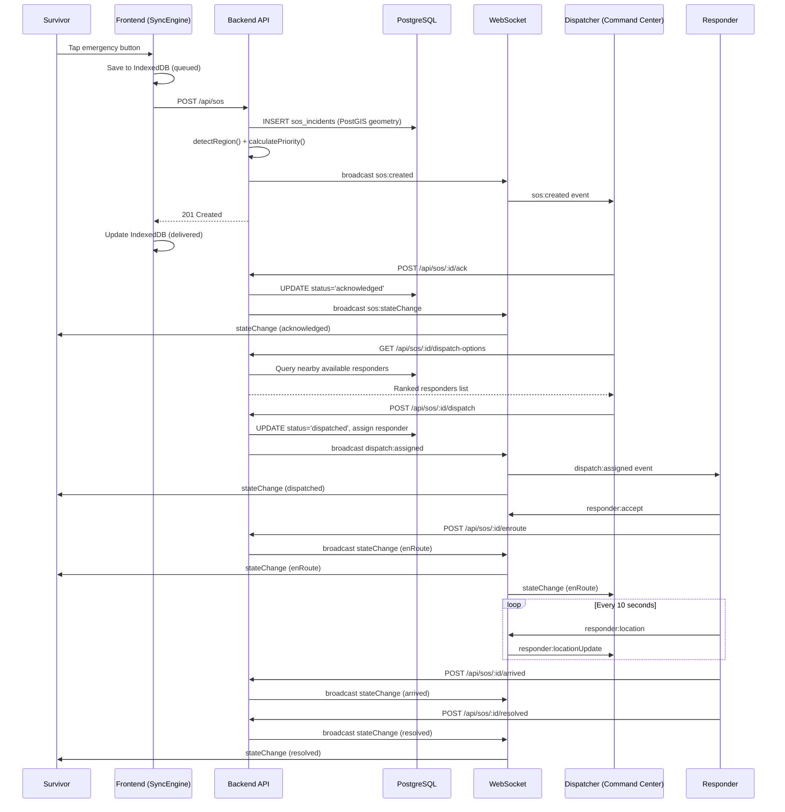

# Design Document

## Introduction

This document describes the technical design for building the remaining frontend pages and backend API endpoints that complete the MeshSOS end-to-end workflow. The existing infrastructure includes a fully tested backend (auth, SOS, dispatch, geo-dispatch, priority, escalation, stations, responders, disasters, audit, push), a deployed PostgreSQL+PostGIS database, WebSocket real-time layer, and foundational frontend components (HomeScreen, QueueListView, CommandCenter, LiveMap, IncidentQueue, DispatchPanel, etc.).

The design focuses on: authentication flow, admin panel composition, responder mobile interface, dispatch wiring, route protection, and the small set of backend endpoints still needed.

---

## Overview



---

## Architecture

### 1. AuthContext & Token Management

**Location:** `frontend/src/context/AuthContext.tsx`

```typescript
interface AuthState {
  user: { id: string; role: string; name: string; email: string } | null;
  accessToken: string | null;
  isAuthenticated: boolean;
  isLoading: boolean; // true during initial refresh attempt
}

interface AuthContextValue extends AuthState {
  login(email: string, password: string): Promise<LoginResult>;
  logout(): Promise<void>;
  refreshToken(): Promise<boolean>;
  getAuthHeaders(): Record<string, string>;
}
```

**Token flow:**
1. On app load: attempt `POST /api/auth/refresh` (HTTP-only cookie). If 200, set user + token. If 401, remain unauthenticated.
2. On login: call `POST /api/auth/login`. Store accessToken in state (not localStorage — XSS risk). Backend sets refresh cookie.
3. On 401 from any API call: attempt refresh. If success, retry original request. If fail, redirect to login.
4. On logout: call `POST /api/auth/logout`, clear state, redirect.

**MFA handling:**
- If login returns `mfaRequired: true`: show TOTP input. On submit, call `POST /api/auth/mfa/verify` with userId + code.
- If login returns `mfaSetupRequired: true`: call `POST /api/auth/mfa/setup`, display QR code, verify first code, then complete login.

---

### 2. Route Structure & Guards

**Location:** `frontend/src/App.tsx` (enhanced hash router)

```
#/              → HomeScreen (public)
#/queue         → QueueListView (public)
#/login         → LoginPage (public)
#/admin         → AdminPanel (requires: administrator)
#/admin/:tab    → AdminPanel sub-pages
#/command-center → CommandCenter (requires: dispatcher, supervisor, administrator)
#/responder     → ResponderView (requires: responder)
#/profile       → ProfileScreen (requires: any authenticated)
```

**ProtectedRoute component:**
```typescript
function ProtectedRoute({ allowedRoles, children }: {
  allowedRoles: string[];
  children: React.ReactNode;
}) {
  const { isAuthenticated, isLoading, user } = useAuth();
  if (isLoading) return <LoadingSpinner />;
  if (!isAuthenticated) { redirect('#/login'); return null; }
  if (!allowedRoles.includes(user!.role)) { redirect('#/'); return null; }
  return <>{children}</>;
}
```

---

### 3. Login Page

**Location:** `frontend/src/features/auth/LoginPage.tsx`

**States:** idle → submitting → mfa_required → mfa_setup → success
**UI:** Centered card with email/password fields, error display, submit button. On MFA: 6-digit code input. On MFA setup: QR code image + verification input.

---

### 4. Admin Panel Layout

**Location:** `frontend/src/features/admin/AdminPanel.tsx`

**Layout:** Sidebar (left, collapsible on mobile) + content area (right).

**Sub-routes (via hash fragment):**
- `#/admin/dashboard` → MetricsDashboard (wired to `GET /api/metrics`)
- `#/admin/regions` → RegionManagement (new component)
- `#/admin/stations` → StationManagement (existing, wired with auth headers)
- `#/admin/responders` → ResponderManagement (new component)
- `#/admin/users` → UserManagement (new component)
- `#/admin/disasters` → DisasterManagement (existing, wired)
- `#/admin/audit` → AuditTrailView (existing, wired)
- `#/admin/health` → SystemHealthPanel (existing, wired)

**New components needed:**
- `RegionManagement`: Leaflet map with Leaflet.Draw for polygon creation, region list, CRUD forms
- `ResponderManagement`: Table of responders with status badges, create form (user dropdown, station, type)
- `UserManagement`: User list with roles, create form, deactivate action

---

### 5. Responder View

**Location:** `frontend/src/features/responder/ResponderView.tsx`

**Layout:** Mobile-first full-screen. Top: status bar + toggle. Center: assignment card or idle state. Bottom: mini-map.

**State machine:**
```
idle (available/offline)
  → assignment_received (dispatch:assigned event)
    → accepted (responder:accept emitted, POST /enroute)
      → arrived (POST /arrived)
        → resolved (POST /resolved) → idle
    → declined (responder:decline emitted) → idle
```

**GPS tracking:** When status is `enRoute` or `onScene`, start a 10-second interval capturing position and emitting `responder:location` via WebSocket.

---

### 6. Command Center Dispatch Wiring

**Location:** Enhance existing `frontend/src/features/command-center/CommandCenter.tsx`

**Addition:** When an incident is selected:
1. Fetch `GET /api/sos/:id` → render IncidentDetailsPanel in a slide-over panel
2. "Acknowledge" button → `POST /api/sos/:id/ack`
3. After ack: fetch `GET /api/sos/:id/dispatch-options` → render DispatchPanel
4. "Assign" button → `POST /api/sos/:id/dispatch` with selected responderId

**Real-time updates:** Already wired via WebSocket listeners.

---

### 7. Survivor Status Enhancement

**Location:** Enhance `frontend/src/App.tsx` queue route

**Addition:**
- Tapping a delivered record opens `SOSTimelineView` with `sosId`
- Establish survivor WebSocket connection with `sessionId` from IndexedDB
- Listen for `sos:stateChange` events and update local state
- After first successful delivery, prompt for push notification permission

---

### 8. New Backend Endpoints

#### `GET /api/sos/:id/dispatch-options`

**Location:** `backend/src/routes/sos.routes.ts`

```typescript
// Requires: authenticate + authorize('sos:dispatch')
// Calls: detectRegion(incident.location) → rankResponders(...)
// Returns: { responders: RankedResponder[] }
```

#### `POST /api/sos/:id/dispatch`

**Location:** `backend/src/routes/sos.routes.ts`

```typescript
// Body: { responderId: string }
// Calls: dispatchService.assignResponder(sosId, responderId, actorId)
// Broadcasts: dispatch:assigned via WebSocket
// Returns: { success: true, incident }
```

#### `GET /api/metrics`

**Location:** `backend/src/routes/metrics.routes.ts`

```typescript
// Requires: authenticate + authorize('metrics:read')
// Queries:
//   - COUNT(*) from sos_incidents WHERE created_at > NOW() - 24h
//   - AVG(resolved_at - created_at) for resolved incidents
//   - COUNT(*) from responders WHERE status != 'offline'
//   - GROUP BY emergency_type, priority_band
// Returns: MetricsData interface
```

#### `POST /api/users` & `GET /api/users`

**Location:** `backend/src/routes/user.routes.ts`

```typescript
// POST: Requires administrator role. Hashes password with bcrypt(12).
// GET: Requires administrator role. Returns id, name, email, role, mfa_enabled, created_at.
```

#### `POST/GET/PATCH /api/regions`

**Location:** `backend/src/routes/region.routes.ts`

```typescript
// POST: { name, boundary: { type: "Polygon", coordinates: [...] } }
//   Converts GeoJSON to ST_GeomFromGeoJSON(...) for insertion
// GET: Returns regions with ST_AsGeoJSON(boundary) as boundary_geojson
// PATCH: Update name, status, or boundary
```

---

## Components and Interfaces

See Architecture section above for detailed component interfaces.

## Data Models



---

### SOS Lifecycle Sequence

See sequence diagram above.

## File Structure (new files)

```
frontend/src/
├── context/
│   └── AuthContext.tsx            # Auth state + token management
├── features/
│   ├── auth/
│   │   ├── LoginPage.tsx          # Login form + MFA handling
│   │   └── MFASetup.tsx           # QR code setup page
│   ├── admin/
│   │   ├── AdminPanel.tsx         # Layout + sidebar + sub-routing
│   │   ├── RegionManagement.tsx   # Regions CRUD + map polygon drawing
│   │   ├── ResponderManagement.tsx# Responder list + create
│   │   └── UserManagement.tsx     # User CRUD
│   └── responder/
│       └── ResponderView.tsx      # Mobile dispatch + status + GPS
├── components/
│   └── ProtectedRoute.tsx         # Role-based route guard
└── services/
    └── api.ts                     # Fetch wrapper with auth headers + refresh

backend/src/
├── routes/
│   ├── region.routes.ts           # POST/GET/PATCH /api/regions
│   ├── user.routes.ts             # POST/GET /api/users
│   └── metrics.routes.ts          # GET /api/metrics
└── services/
    └── user.service.ts            # createUser, listUsers
```

---

## Technology Choices

| Concern | Choice | Rationale |
|---------|--------|-----------|
| Map polygon drawing | leaflet-draw | Already using Leaflet; lightweight polygon creation |
| Auth token storage | React state (memory) | XSS-safe; refresh cookie handles persistence |
| Route guards | Custom hook + wrapper | No router library needed; hash-based routing is already in place |
| API fetch wrapper | Custom with interceptors | Attach auth headers, handle 401 → refresh → retry |
| Responder GPS | navigator.geolocation.watchPosition | Built-in, battery-efficient with 10s interval |
| MFA QR codes | otpauth URI + inline SVG | No external QR library needed; backend generates the URI |

---

## Security Considerations

1. Access tokens live only in React state — never in localStorage or sessionStorage
2. Refresh tokens are HTTP-only, Secure, SameSite=Strict cookies (already implemented in backend)
3. All admin/dispatch/responder routes require valid JWT with matching role claim
4. `POST /api/users` enforces administrator role and validates password strength
5. Region boundary input is validated server-side with `ST_IsValid()` before insertion
6. Rate limiting is already applied globally (100/min) and per-SOS (10/min)

---

## Dependencies (new)

| Package | Purpose | Workspace |
|---------|---------|-----------|
| `leaflet-draw` | Polygon drawing on admin regions page | frontend |
| `@types/leaflet-draw` | TypeScript definitions | frontend (dev) |

All other dependencies (leaflet, socket.io-client, react, dexie, uuid, bcrypt, pg, etc.) are already installed.

---