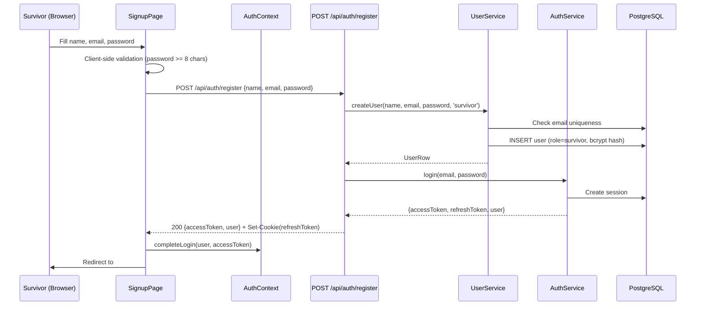
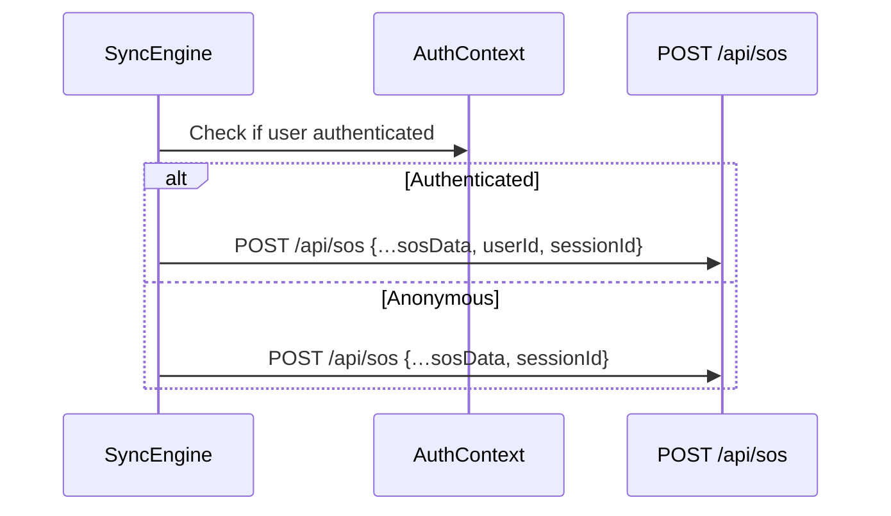

# Design Document: Survivor Signup

## Overview

This design adds a public self-registration flow to MeshSOS so survivors can create accounts and gain persistent SOS history across devices. The implementation reuses existing infrastructure (user service, auth service, AuthContext) and adds a minimal set of new components: a `POST /api/auth/register` endpoint, a `SignupPage` React component, and a modification to the SyncEngine to include `userId` when authenticated.

The design preserves the existing anonymous SOS flow — survivors who choose not to register continue to use device-session-based identification without friction.

Email verification (Requirement 7) is deferred to a future iteration. The initial implementation focuses on account creation, session management, and persistent history.

## Architecture



The registration endpoint reuses `createUser()` from `user.service.ts` (extended to accept `'survivor'` as a valid role for self-registration) and `login()` from `auth.service.ts` to issue tokens immediately after account creation.

### Persistent History Flow



When a survivor is authenticated, the SyncEngine includes `userId` in the SOS payload. The backend associates the SOS record with that user, enabling cross-device history retrieval.

## Components and Interfaces

### Backend: Registration Endpoint

**File:** `backend/src/routes/auth.routes.ts`

```typescript
// POST /api/auth/register
// Body: { name: string, email: string, password: string }
// Success: 200 { accessToken: string, user: { id, role, name, email } }
// + Set-Cookie: meshsos_refresh_token (HTTP-only)
// Errors: 400 (validation), 409 (duplicate email)
```

The endpoint is added to the existing `auth.routes.ts` file alongside `/login`, `/logout`, and `/refresh`. It:
1. Validates inputs (name non-empty, email valid, password >= 8 chars)
2. Calls `createUser(name, email, password, 'survivor')` from `user.service.ts`
3. Calls `login(email, password)` from `auth.service.ts` to create a session and issue tokens
4. Sets the refresh token cookie and returns `{ accessToken, user }`

### Backend: UserService Extension

**File:** `backend/src/services/user.service.ts`

The existing `VALID_ROLES` array is extended to include `'survivor'`. A new `registerSurvivor()` function is added (or `createUser` is called directly with role `'survivor'`) to keep the admin-only path distinct. The `validateRole()` function is updated to accept `'survivor'` in the self-registration context.

Alternatively, a separate `SELF_REGISTER_ROLES` constant can be added:

```typescript
const SELF_REGISTER_ROLES = ['survivor'] as const;
```

This keeps admin role validation separate from self-registration role validation.

### Frontend: SignupPage Component

**File:** `frontend/src/features/auth/SignupPage.tsx`

A form component following the same patterns as `LoginPage.tsx`:
- Fields: name, email, password
- Client-side validation: password length >= 8 characters (inline message)
- Submit handler: POST to `/api/auth/register`, show loading state
- Success: call `completeLogin(user, accessToken)` from `AuthContext`, redirect to `#/`
- Failure: display error in `role="alert"` element
- Navigation link to `#/login` for existing users

### Frontend: App Route Registration

**File:** `frontend/src/App.tsx`

Add route matching for `#/signup`:

```typescript
if (route === '/signup') {
  return <SignupPage />;
}
```

Placed before the default route, after `/login`. No `ProtectedRoute` wrapper — signup is public.

### Frontend: LoginPage Link

**File:** `frontend/src/features/auth/LoginPage.tsx`

Add a "Create an account" link pointing to `#/signup`, placed near the existing "Back to home" link.

### Frontend: SyncEngine userId Injection

**File:** `frontend/src/services/sync-engine.service.ts`

Modify `attemptDelivery()` to include `userId` when the user is authenticated. The SyncEngine will read the current user from a token getter (similar pattern to `api.ts`):

```typescript
// In the POST body:
body: JSON.stringify({
  ...sosData,
  sessionId,
  ...(getUserId() ? { userId: getUserId() } : {}),
}),
```

A `setUserIdGetter` function will be wired by `AuthContext` on mount, similar to how `setTokenGetter` works in `api.ts`.

## Data Models

### Registration Request/Response

```typescript
// Request body
interface RegisterRequest {
  name: string;      // Non-empty, trimmed
  email: string;     // Valid email format, lowercased
  password: string;  // >= 8 characters
}

// Success response (200)
interface RegisterResponse {
  accessToken: string;
  user: {
    id: string;
    role: 'survivor';
    name: string;
    email: string;
  };
}

// Error response (400 | 409)
interface RegisterError {
  error: string;
}
```

### Database: Users Table

No schema migration needed. The existing `users` table already supports:
- `id` (UUID, primary key)
- `name` (text)
- `email` (text, unique)
- `password_hash` (text)
- `role` (text) — accepts `'survivor'`
- `mfa_enabled` (boolean, defaults false)
- `created_at` (timestamp)

### SOS Payload Extension

```typescript
// Extended sync payload when authenticated
interface SOSSyncPayload {
  id: string;
  emergencyType: string;
  latitude: number | null;
  longitude: number | null;
  // ... existing fields ...
  sessionId: string;        // Always present (device session)
  userId?: string;          // Present when authenticated survivor
}
```

## Correctness Properties

*A property is a characteristic or behavior that should hold true across all valid executions of a system — essentially, a formal statement about what the system should do. Properties serve as the bridge between human-readable specifications and machine-verifiable correctness guarantees.*

### Property 1: Valid Registration Produces Correct Response

*For any* valid combination of name (non-empty after trim), email (contains '@' and valid format), and password (length >= 8), the Registration API SHALL create a user with role `survivor`, return an access token in the response body, and set an HTTP-only refresh token cookie.

**Validates: Requirements 1.1, 1.7**

### Property 2: Short Passwords Are Rejected

*For any* password string with length less than 8 characters, the Registration API SHALL return a 400 status code and not create a user record.

**Validates: Requirements 1.3**

### Property 3: Invalid Required Fields Are Rejected

*For any* registration request where the email is missing/invalid (does not contain '@') OR the name is empty/whitespace-only, the Registration API SHALL return a 400 status code and not create a user record.

**Validates: Requirements 1.4, 1.5**

### Property 4: Password Storage Uses Bcrypt Cost 12

*For any* successful registration, the stored `password_hash` SHALL be a valid bcrypt hash with cost factor 12, and `bcrypt.compare(originalPassword, storedHash)` SHALL return true.

**Validates: Requirements 1.6**

### Property 5: Authenticated SOS Includes User ID

*For any* authenticated survivor with a valid userId, when the SyncEngine delivers an SOS record, the HTTP payload SHALL include the `userId` field matching the authenticated user's ID.

**Validates: Requirements 6.1**

## Error Handling

| Scenario | HTTP Status | Error Message | Frontend Behavior |
|----------|-------------|---------------|-------------------|
| Missing/empty name | 400 | "Name is required" | Display in alert |
| Missing/invalid email | 400 | "A valid email address is required" | Display in alert |
| Password < 8 chars | 400 (client-side blocks) | "Password must be at least 8 characters" | Inline validation message |
| Duplicate email | 409 | "A user with this email already exists" | Display in alert |
| Network error | N/A | "Network error. Please try again." | Display in alert |
| Server error | 500 | "Internal server error" | Display in alert |

**Client-side validation** prevents submission for password length only. Other validations are server-side to keep the form responsive and avoid duplicating complex email validation logic.

**Error display**: All API errors render in a `<div role="alert">` element matching the pattern used in `LoginPage.tsx`.

## Testing Strategy

### Property-Based Tests (Backend)

**Library:** `fast-check` (already used in the frontend test suite)

Each correctness property maps to a property-based test with minimum 100 iterations:

- **Property 1**: Generate random valid (name, email, password) inputs → verify response shape and role
- **Property 2**: Generate random strings of length 0-7 → verify 400 rejection
- **Property 3**: Generate random invalid emails and empty names → verify 400 rejection
- **Property 4**: Generate random valid inputs → verify stored hash is bcrypt cost-12 and compares correctly
- **Property 5**: Generate random userIds → verify SyncEngine includes userId in POST body

Tag format: `Feature: survivor-signup, Property {N}: {description}`

### Unit Tests (Frontend)

- **SignupPage rendering**: Form fields present, link to login exists
- **SignupPage submission**: Loading state on button, API called with correct body
- **SignupPage success**: `completeLogin` called, redirect to `#/`
- **SignupPage error**: Alert element displayed with error message
- **SignupPage validation**: Inline message for short passwords, form not submitted
- **App routing**: `#/signup` renders SignupPage without auth requirement
- **LoginPage link**: "Create account" link present and points to `#/signup`

### Integration Tests (Backend)

- Full registration flow: register → verify user in DB → verify session created
- Duplicate email: register twice → verify 409 on second attempt
- Login after registration: register → logout → login with same credentials
- Persistent history: register → create SOS with userId → query SOS by userId from different session

### Smoke Tests

- Anonymous SOS flow still works without authentication (non-regression)
- Signup page accessible without login
